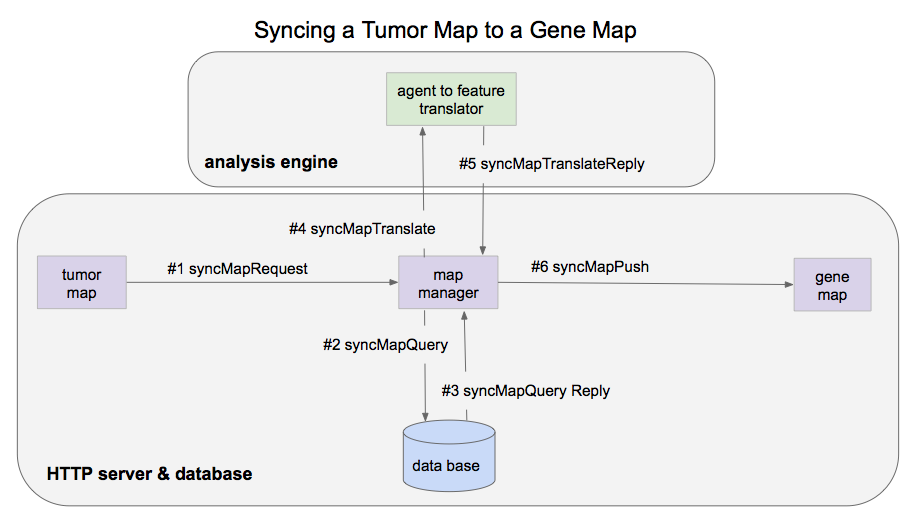

Map Manager
===========

The map manager handles the communications for synchronizing a user
selection of node IDs from one map to another map. The map manager queries the
target map database using the source map's node IDs. The magician then does
some magic to produce values for a list of target node IDs. These IDs and values
are sent to the target map as a generated attribute.

(source: https://docs.google.com/presentation/d/1gUGZ2PJlEKybW9ZVv7y96lUxOjlKoA3H8kClXNbnVcc/edit#slide=id.g12bf66a90e_0_0)

**An example sequence of calls follows.**

#1 syncMapRequest
-----------------
A request to sync from a source map to another map, sent to the map manager
from the source map via http::

 {
    "map": "CKCC/v1",
    "layout": "mRNA",
    "fromMapType": "tumorMap",
    "toMapType": "geneMap",
    "selection": "Kidney",
    "nodes': [
        "mySample1",
        "mySample2",
        ...
    ]
 }

#2 syncMapQuery
---------------
A query of the database from the map manager to the DB::

 {
    "map": "CKCC/v1",
    "layout": "mRNA",
    "fromMapType": "tumorMap",
    "toMapType": "geneMap",
    "nodes': [
        "mySample1",
        "mySample2",
        ...
    ]
 }

#3 syncMapQueryReply
--------------------
The query response from the database to the map manager, where the values are
one for each source node ID. Is that right, or does the magician need all of the
node values?::

 {
    "selection": "Kidney",
    "genes": {
        "gene1": [
            "value",
            "value",
            ...
        ],
        "gene2" [
            "value",
            "value",
            ...
        ],
    ...
    ]
 }

* Note: This returns all values, including NA values.

#4 syncMapMagic
----------------
The data going from the map manager to the magician::

 {
    "gene1": [
        "value",
        "value",
        ...
    ],
    "gene2" [
        "value",
        "value",
        ...
    ],
    ...
 }

#5 syncMapMagicReply
--------------------
The data returned from the magician to the map manager::

 {
    "gene1": "value",
    "gene2": "value",
    ...
 }

#6 syncMapPush
--------------
The request sent to the target map from the map manager. This will be displayed
on the UI as a generated attribute::

 {
    "layer": "Kidney",
    [
        "gene1": "value",
        "gene2" "value",
        ...
    ]
 }
