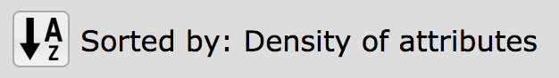
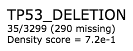
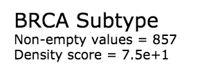
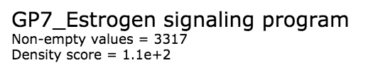
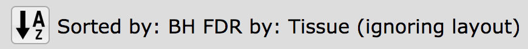
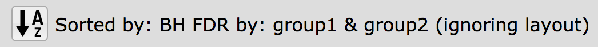
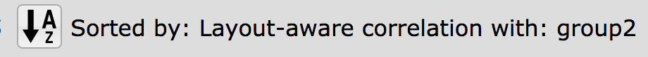
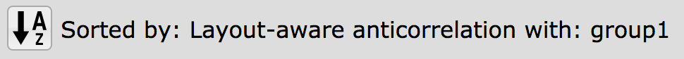
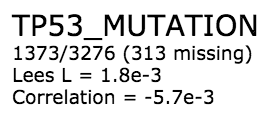

Attribute Information
=====================

Each attribute has information displayed below the attribute name in the
**Select Attribute** list and in the **Short List**. This
information is specific to the :doc:`data type <dataTypes>` and the
:doc:`statistical sort <statsNsort>`
in effect.

Data Types and Density Sort
---------------------------

The default sort of attributes in the **Select Attributes** list is by density.
Below is the message that is displayed in the header with the density sort in effect:

Below are examples of the information
displayed for the density sort for each of the data types: binary, categorical
and continuous, respectively.

Binary attributes show values counts as
*count_of_ones/count_of_zeros (count_of-empty-or-NA)*
while categorical and continuous attributes show the count of values that don't
include empty or *NA* values.

Technical information may be found at :ref:`densityTech`.

Layout-Independent Statisitics
------------------------------

Below is the message that is displayed in the header with the
layout-independent statistic sort in effect:

Example attribute information:

.. image:: _images/attrInfo-4.png
   :width: 200 px

Technical information may be found at :ref:`layoutIndependentTech`.

Differential Statisitics
------------------------

Below is the message that is displayed in the header with the
differential statistic sort in effect:

An example attribute display for differential statistics is the same as above
for layout-independent statistics.

Technical information may be found at :ref:`layoutIndependentTech`.

Layout-Aware Statisitics
------------------------

Below is the message that is displayed in the header with the
**positive correlation** layout-dependent statistic sort in effect:

Below is the message that is displayed in the header with the
**negative correlation** layout-dependent statistic sort in effect:

An example attribute display for layout-aware statistics:

Technical information may be found at :ref:`layoutDependentTech`.

