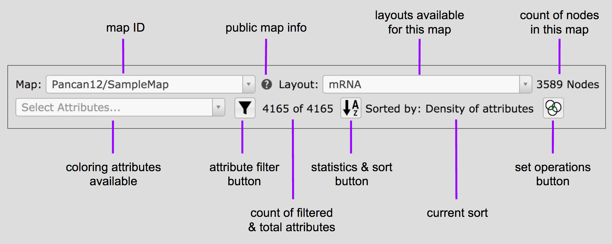

Basic Controls
==============

The controls described here are available on the map layout page so if you are
on the home page, get to the map page with a click on a map thumbnail.

Basic Tumor Map controls include the ability to navigate the map,
color the map and view a node's details.

.. _navigateTheMap:

Navigate the Map
----------------

Zooming and panning are identical to that of a terrestrial Google Map.

To zoom you may use the
|plus-minus| controls in the lower right of the window,
or the **+**/**-** keys on your keyboard.

.. |plus-minus| image:: _images/plusMinus.png
   :width: 20 px

To pan or move around the map, click and drag the map,
or use the left and right arrows on your keyboard.

Color the Map by Attribute
--------------------------

Nodes in the map are colored by attribute values. This allows you to visually explore
the attributes and their relationships to the layout and to each other.

To select an attribute for coloring the map, click on **Select Attributes**
and type in a few letters within the attribute name.
If it exists, it will be displayed along with other attributes matching the string.
Click on the attribute to color the map with those values.
The attribute will appear in the **Short List** at the upper right of the
map
.
The **Select Attributes** drop down contains all the attributes
available for the map, while the **Short List** contains only those attributes
that have already been selected.

The statistics display is explained at :doc:`attrInfo`, with a
technical discussion at :doc:`statsNsort`.

To Select attributes for display click on the |primary| or |secondary| in the
**Short List** entry.
No more than two attributes may be selected to color the nodes at a time.

.. |primary| image:: https://tumormap.ucsc.edu/icons/primary.png
   :width: 20 px
.. |secondary| image:: https://tumormap.ucsc.edu/icons/secondary.png
   :width: 20 px

Clicking on |primary-hot| or |secondary-hot| will turn that attribute
display off.

.. |primary-hot| image:: https://tumormap.ucsc.edu/icons/primary-hot.png
   :width: 20 px
.. |secondary-hot| image:: https://tumormap.ucsc.edu/icons/secondary-hot.png
   :width: 20 px

More information may be found at :doc:`shortlist`.

Header Anatomy
--------------

|header|

**attribute filter button** and **count of filtered and total attributes**
are explained at :doc:`filter`

**statistics and sort button** and **current sort** are explained at
:doc:`statsNsort`

**set operations button** is explained at :doc:`setOper`

**coloring attributes available** is explained in the section above,
`Color the Map By Attribute`_

View a Node's Details
---------------------

In order to view information about the specific nodes in the map, just click on the
node. You may need to zoom in for the nodes to be big enough to click on
the node of interest. This window will show the values of any attributes in
the **Short List**.
