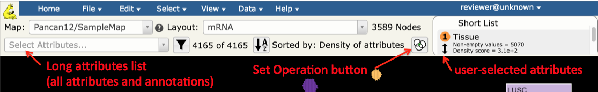
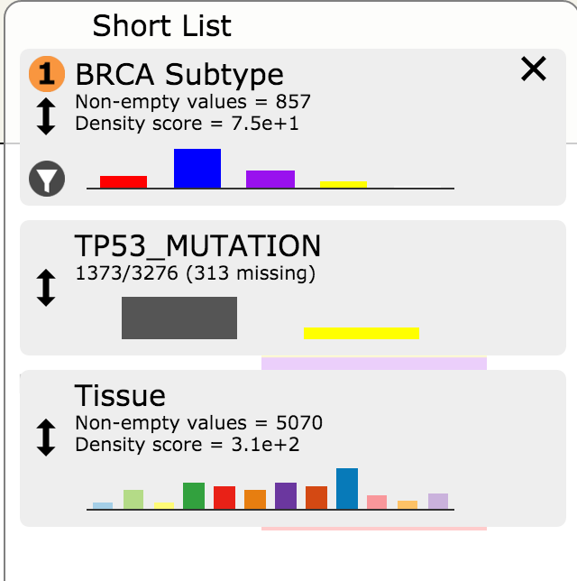
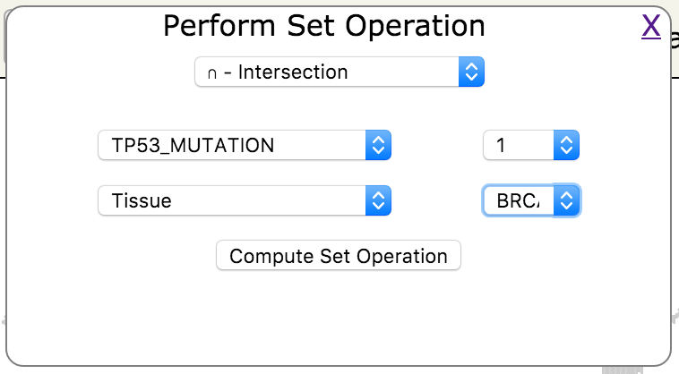
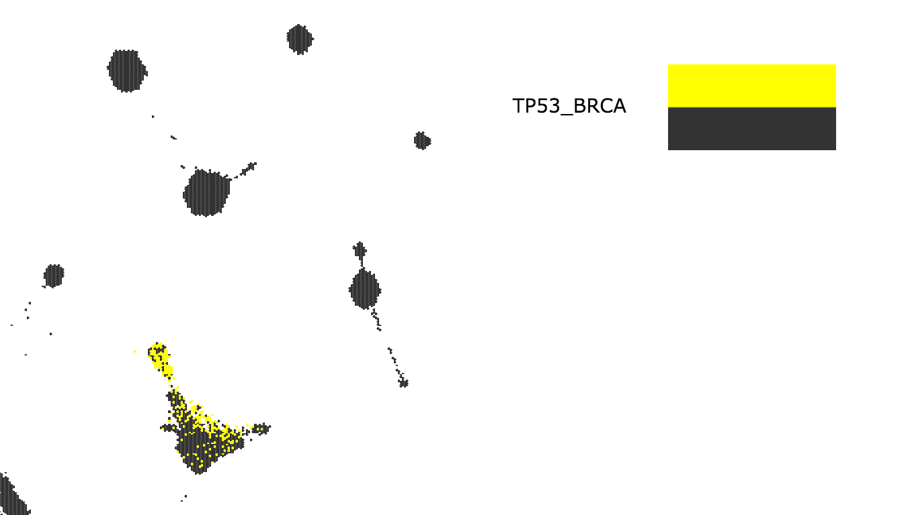

.. _whichSampleShare:

Which samples share a particular genomic alteration?
====================================================

Objective
---------

View all of the samples that share a particular genomic alteration of interest
(e.g. TP53 mutation).

Skills Covered
--------------

* Familiarity with the attribute drop down list
* Familiarity with using the *Short List* of user selected/defined attributes.
* Set Operation to create a new attribute derived from existing attributes.
* Exporting a list of sample identifiers into a downloadable file.

Steps
-----

1. Get started with selecting samples on a Tumor Map. The Tumor Map UI provides users with a *Select Attributes* drop down that contains full list of sample annotations and attributes (*long list*) from which to choose attributes of interest, and a *Short List* that allows users more fine-tuned control of map operations.
2. In this tutorial we will go through how to select attributes of interest, and then perform an intersection set operation to create a new custom attribute. Let’s say we are interested in viewing breast cancer samples that also have TP53 mutations, and then downloading a list of their sample IDs.

3. In the *Select Attributes* drop down select *Tissue* and *TP53_MUTATION* attributes by typing in the beginning of the attribute name and clicking on the appropriate option in the list. This will copy the Tissue and TP53_MUTATION attributes from the *long* to the *Short List*
        NOTE: The tissue attribute might already be in the *Short List* as the default.

4. In *Select Attributes* select *BRCA Subtype* by typing in the beginning of the attribute name and clicking on the appropriate selection in the list.

5. Click on the *Set Operation* button. Its placement is shown in the graphic at the top of this page.

6. In the popup window select *Intersection* for the desired set operation and select *TP53_MUTATION* as the first attribute and *Tissue* as the second attribute. Next to *TP53_MUTATION* click on the *value* drop down and click on *1*. Next to *Tissue* select the value *BRCA*; click on the *Compute Set Operation* button.

7. Enter the desired name of this new custom group of samples (e.g. TP53_BRCA)

8. Observe that the new group appears as a custom attribute in the *Short List*

9. In the *Short List*, if *TP53_BRCA* does not have a |primary-hot|, click on the |primary| to select it for color display

.. |primary-hot| image:: https://tumormap.ucsc.edu/icons/primary-hot.png
   :width: 20 px

.. |primary| image:: https://tumormap.ucsc.edu/icons/primary.png
   :width: 20 px

10. Observe that the TP53 BRCA mutants are highlighted in the map

11. Go to the *File* menu, then *Download* and click on *Node IDs*

12. In the popup window make sure that *TP53_BRCA* is selected

13. Save this group to a local file using the browser’s file download functionality

NOTE: You can just copy the sample IDs to the local computer memory by clicking into the box that contains the IDs to highlight them and then right-click and select *Copy*

