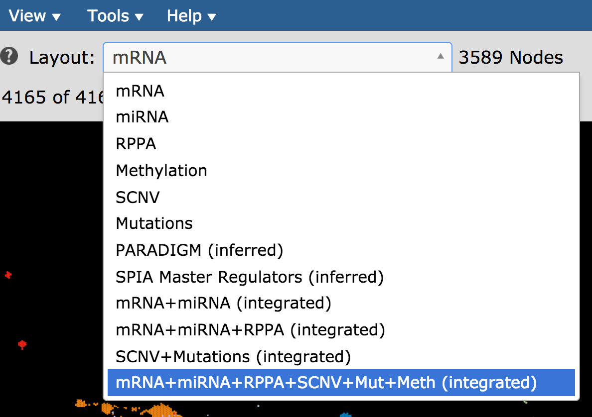
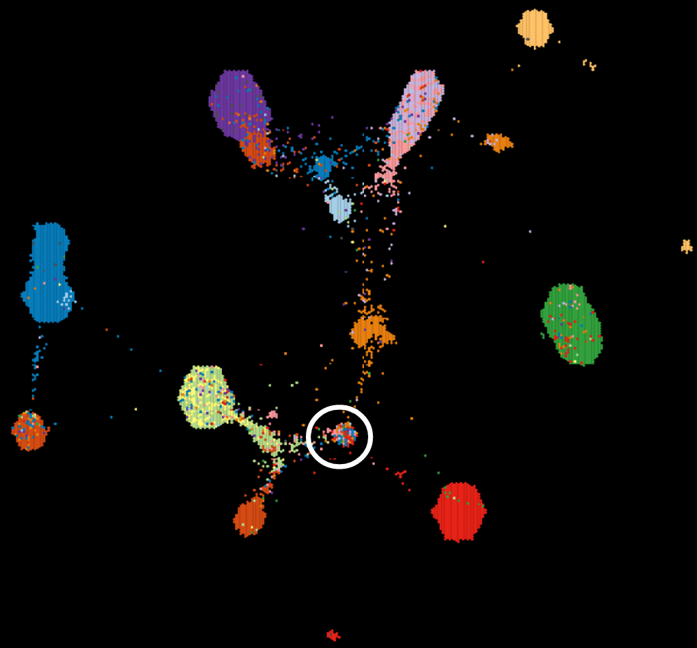
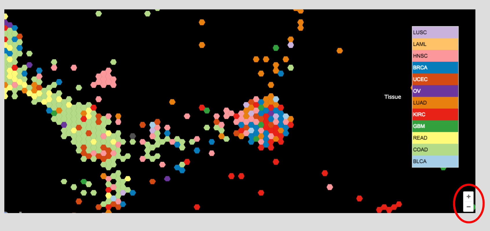
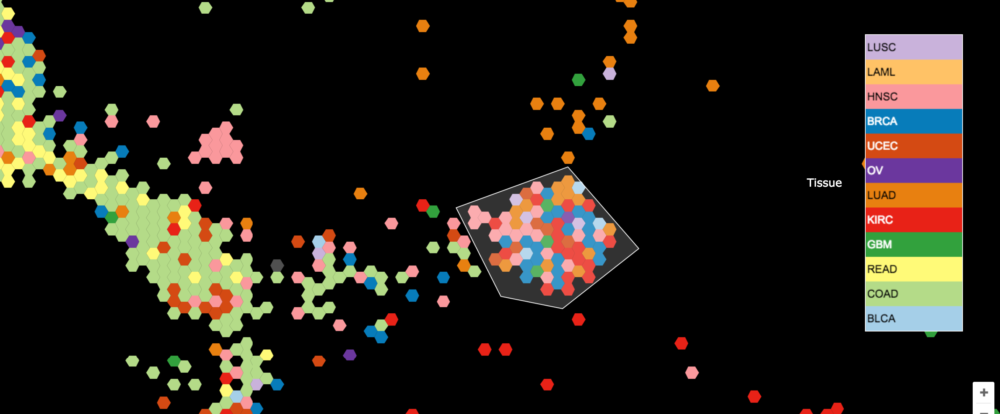
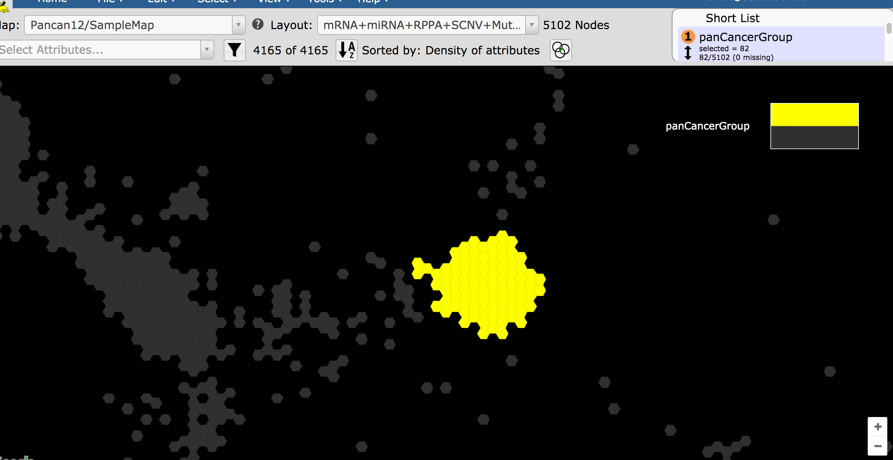

How are custom annotations created?
===================================

Objective
---------
Make a group from a set of samples of interest.

Skills Covered
--------------

* Selecting a new data type to view as a new layout.
* Create a new group from a user-drawn region encompassing a set of samples.

Steps
-----

1. With the map, **Pancan12/SampleMap**, select the layout, **mRNA+miRNA+RPPA+SCNV+Mut+Meth (integrated)** as in the picture below.

2. In the Short List, make sure **Tissue** is checked and no other attributes are checked.

3. In the middle of the map you can find a cluster of samples of mixed tissue of origin, as in the picture below. This is our pan-cancer group of interest.

4. Use the zoom control in the bottom right of the map to zoom into the region containing the pan-cancer group.

5. Click on the **Select** menu then click on **by Polygon**.

6. Select the samples belonging to the pan-cancer group by clicking to define each vertex of the polygon. Double-click to complete the polygon.

7. Specify the name of the group (e.g. PancancerGroup) in the popup window.

8. Notice that this group is now selected and the new annotation/attribute shows up in the Short List with a lavender background indicating it is a generated attribute.

