Which genes and pathways drive clustering of basal breast tumors?
=================================================================

Objective
---------

Use sorting of attributes to identify genes and pathways driving
clustering of basal breast tumors.

Skills Covered
--------------

* Sign into the Tumor Map.
* Creating a new group from an existing categorical (multi-valued) attribute.
* Running statistical test to order attributes based on their differential
  presence/absence in one group versus another.

Steps
-----

1. Click **Sign In** at the far upper right and enter your credentials. You must
   be signed in to complete this tutorial. Also, your account must have
   authorization to run compute-intensive jobs. You can ask for authorization
   from hexmap at ucsc dot edu.

2. With the map, **Pancan12/SampleMap**, make sure the **mRNA** layout is
   selected and only **Tissue** is selected in the Short List. Observe that
   breast tumors are in blue on the bottom right of the map.

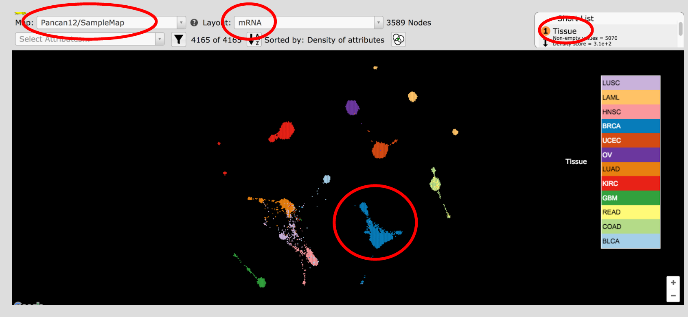

3. In **Select Attribute** type in **brca** and click on **BRCA Subtype**.
   Observe that the breast tumors are colored by the molecular subtypes.
   Use the
   |plusMinus|
   on the bottom right of the screen to zoom into
   the BRCA island. Click and drag to move the image.

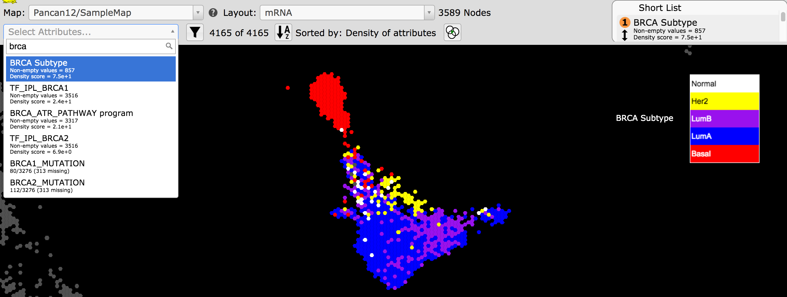

4. In the Short List **BRCA Subtype** entry click on the filter button
   |shortlistFilterButton| and select **Basal** in the drop down menu. Then
   click the create attribute button |shortlistCreateAttr|. Name this attribute.
   **Basal_BRCA**.

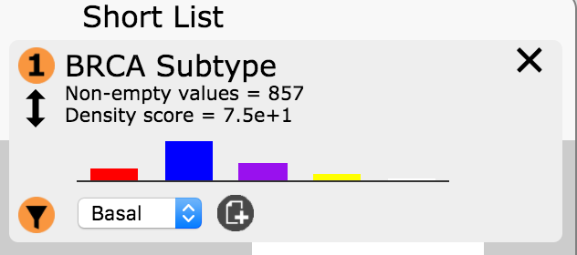

5. Hover on the **Tools** menu then click on **Map Reflection**.

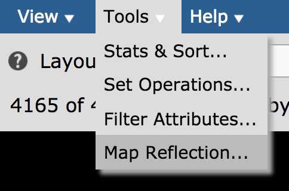

6. In the **Reflect on another Map** window make sure the values are selected
   as below and click **Reflect**.

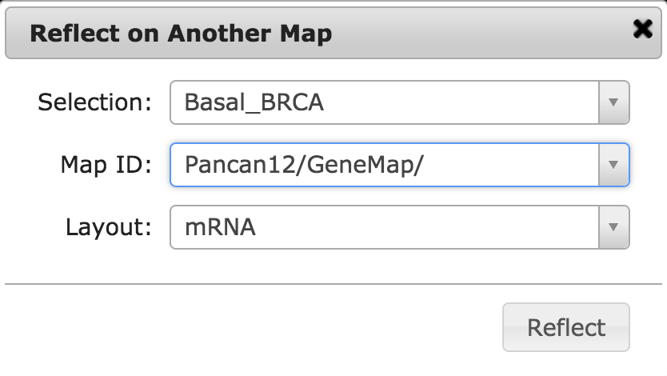

7. The reflection target map, **Pancan12/GeneMap**, will open in another tab of
   your browser with the reflection data displayed as the attribute,
   **Basal_BRCA_mRNA_Reflect**. Enrichment of *high* genes
   are shown in red, while enrichment of *low* genes are in green. Grey
   indicates genes that are not *drivers* of the clustering of the basal BRCA
   samples.

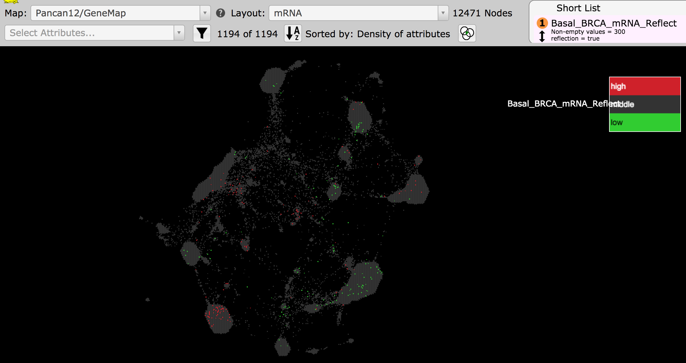

8. Zoom into the regions enriched in *high* genes and position that
   region in the middle of your screen. Examine these regions by eye.

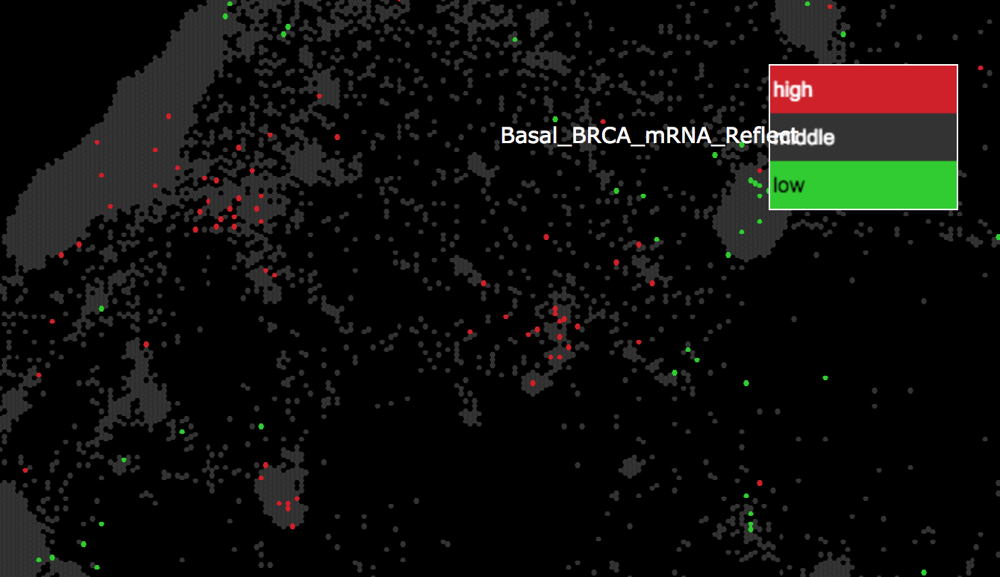

9. Repeat the same steps as above to examine the regions enriched in *low* genes.

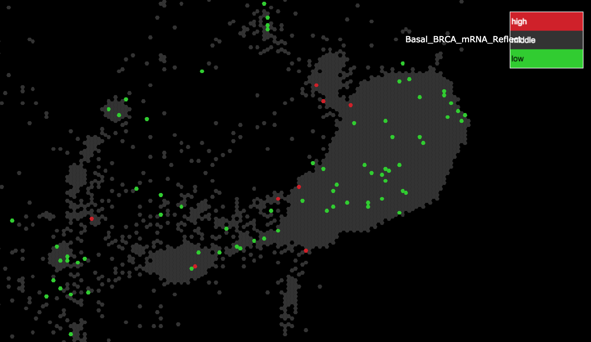

10. In the Short List **Basal_BRCA_mRNA_Reflect** entry click on the filter button
    |shortlistFilterButton| and select **high** in the drop down menu. Then
    click the create attribute button |shortlistCreateAttr|. Name this attribute
    **Basal_BRCA_high**.

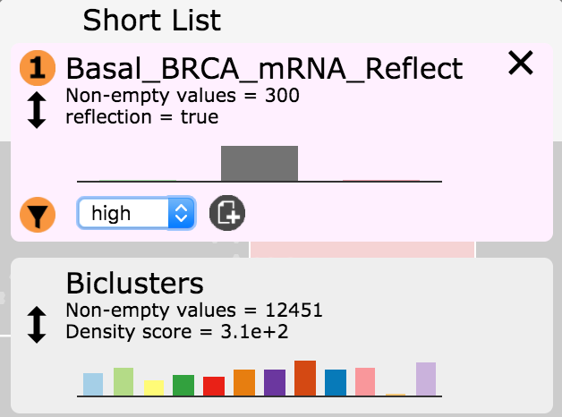

11. Zoom out to
    observe all the genes highlighted as being *high* in Basal BRCA clustering.

    Note: these are the same genes that were colored red in step 3.

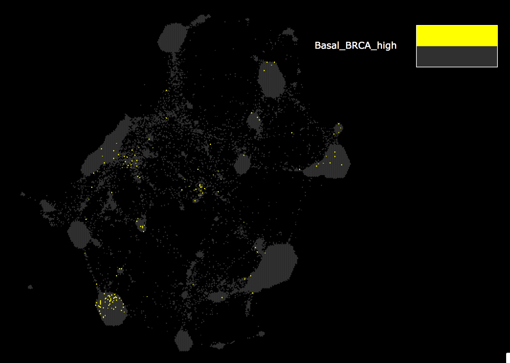

12. Hover on the **File** menu, then hover on **Download**, then click on
    **Node IDs**.

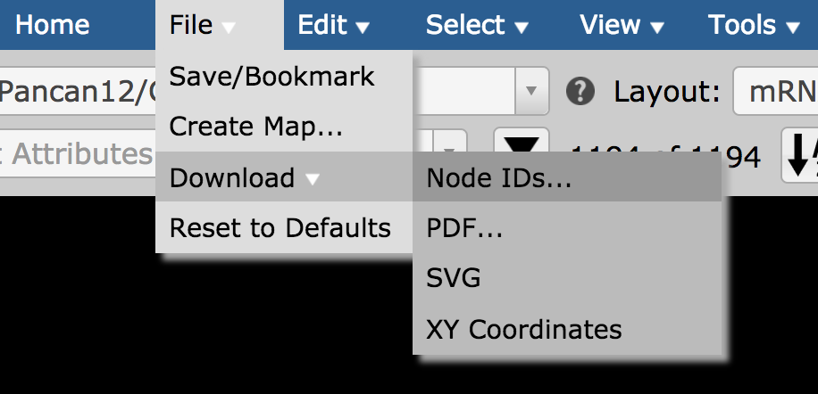

13. In the export window make sure **Basal_BRCA_high** is selected and click
    on **Download As Text**. Save this list as a file to your local directory.

    Note: you are now able to do additional downstream analysis with this gene
    set. (e.g. gene set enrichment analysis, subnetwork visualization, etc.)

.. |shortlistFilterButton| image:: https://tumormap.ucsc.edu/icons/filter.png
   :width: 20 px

.. |shortlistCreateAttr| image:: https://tumormap.ucsc.edu/icons/file-new.png
   :width: 20 px

