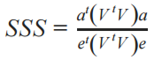

Statistics and Sorting Tool
===========================

Statistics and sorting of attributes may be performed by clicking on the
**Tools** menu then clicking on **Stats & Sort** or by clicking on this sort
button in the main window header: |sort|

.. |sort| image:: https://tumormap.ucsc.edu/icons/sort-attributes.svg
   :width: 20 px

The resulting window,
**Sort Attributes by Associative Statistics** is described below.

Input Descriptions
------------------

Sort By
^^^^^^^
    
**Focus Attribute** :
Selecting this option allows users to sort attibutes by their relation to a
single (or *focus*) attribute. For instance, choosing a *focus attribute* of
TP53 mutations will sort all attributes in the "Select Attributes" drop down
relative to each attribute's association with the TP53 mutations attribute. A
use case displaying this functionality can be seen at
`What is the top differentiating attribute for squamous-like bladder cancer? <https://tumormap.ucsc.edu/useCases/u5/UseCase5.html>`_
See the `Technical Overview`_ below for details on ranking metrics.

**Differential Attributes** :
Selecting this option allows users to sort attributes by how well they
distinguish one group of samples from another. The two groups of samples must be
disjoint and user generated. A use case displaying this functionality can be
seen at
`Which genomic events distinguish one subtype of cancer from another? <https://tumormap.ucsc.edu/useCases/u6/UseCase6.html>`_
See the `Technical Overview`_ below for details on ranking metrics.

**Density Of Attributes** :
Selecting this option allows sorts the attributes by their coherence with the
map placement. Attributes with high density will appear more grouped together
than attributes with lower density.
See the `Technical Overview`_ below for details on ranking metrics.

Layout
^^^^^^

**Layout independent** :
This option is for Attibute level statistics, map placement is not considered.

**Layout Aware** :
This option looks for correlation of attributes with map placement.

Note that these options are only available when using **Focus Attribute**.

Correlation
^^^^^^^^^^^

**Positive** :
Direct correlation with map placement.

**Negative** :
Inverse correlation with map placement.

Note that these options are only available when using **Focus Attribute** and
**Layout Aware**.

Attribute A and Attribute B
^^^^^^^^^^^^^^^^^^^^^^^^^^^

Select the attributes to sort on. These attributes must already be in the
**Short List**.

Technical Overview
------------------

- Layout Independent: Attribute Enrichment Analysis

	- Focus Attribute (Bivariate Statistics)

	- Differential Attributes (Two Population Tests)

- Layout Dependent: Spatial Correlation Analysis

	- Focus Attribute (Bivariate Spatial Association)

	- Density (Spatial Smoothing Scalar)

Layout Independent: Attribute Enrichment Analysis
^^^^^^^^^^^^^^^^^^^^^^^^^^^^^^^^^^^^^^^^^^^^^^^^^

Layout independent associations are provided by statistical tests. 

- Focus Attribute (Bivariate Statistics)

	Each attribute is compared to the focus attribute using an appropriate statistical test. If there are 300 attributes on the map, 1 is chosen as the focus attribute, and 299 statistical tests will provide the rankings. The appropriate test is chosen based upon the combination of data types between the focus attribute and other attribute (see table 1 below). The final ranking is provided by Benjamin-Hochberg False Discover Rates for the association of each attribute with the focus attribute.

- Differential Attributes (Two Population Statistics)

	The user must provide two sample groupings, each attriute is tested against the null hypothesis that the two groupings come from the same distribution (two-tailed). An appropriate test is chosen based upon the datatype of each attribute (see table 2 below). If there are 300 attributes on the map, 300 statistical tests will provide the rankings. The final ranking is provided by Benjamin-Hochberg False Discover Rates for the statistical tests.

**Table 1**

+------------------+--------------+---------------+------------------+
| Attribute Type   |    Binary    |  Categorical  | Continuous       |
+==================+==============+===============+==================+
|   **Binary**     | Fisher Exact |   Chi Square  |  Welch's t-test  |
+------------------+--------------+---------------+------------------+
| **Categorical**  |       -      |   Chi Square  |  Kruskal-Wallis  |
+------------------+--------------+---------------+------------------+
|**Continuous**    |      -       |     -         |   Pearson Rho    |
+------------------+--------------+---------------+------------------+

**Table 2**

+------------------+--------------+---------------+------------------+ 
| Attribute Type   |    Binary    |  Categorical  | Continuous       | 
+==================+==============+===============+==================+ 
|*Statistical Test*| Fisher Exact |   Chi Square  |  Welch's t-test  | 
+------------------+--------------+---------------+------------------+

Layout Dependent: Spatial Correlation Analysis
^^^^^^^^^^^^^^^^^^^^^^^^^^^^^^^^^^^^^^^^^^^^^^

Layout Dependent metrics measure the relationship between map placement and attribute values.

Layout Dependent metrics are implementations of Sang-ll Lee's work, exhausting detail can be found in this `paper <https://link.springer.com/article/10.1007/s101090100064>`_ 

A similarity matrix representing proximity of samples on the map (i.e. a *spatial weight matrix*) needs to be constructed to calculate the metrics for density and bivariate spatial association. We have chosen the inverse eucledian distance of samples on the x-y plane for the spatial weight matrix.

Focus Attribute (Bivariate Spatial Association)
^^^^^^^^^^^^^^^^^^^^^^^^^^^^^^^^^^^^^^^^^^^^^^^

Lee's L Bivariate Spatial Association metric is used to determine the strength of the relationship between two attributes considering placement on the map. 

Currently this operation is only permitted on binary attributes.

Preprocessing includes:
	Subsetting attributes down to ids in the spatial weight matrix

	Z-scoring binary attributes 

	Setting all missing values to 0

The equation for Lee's L:

.. image:: _images/leesL.png
	:width: 200px
 
Where:
	*a* is a z-scored attribute vector

	*b* is another z-scored attribute vector

	*V* is the spatial weight matrix

	*e* is a vector filled with 1's the same length as **a** and **b** 

Density (Spatial Smoothing Scalar)
^^^^^^^^^^^^^^^^^^^^^^^^^^^^^^^^^^

The spatial smoothing scalar is used to describe the strength of the dependence between map placement and a single attribute.

For each attributes calculation, missing values are excluded from the spatial weight matrix.

For continuous and binary variables, Lee's spatial smoothing scalar is used:

Where:
	*a* is a z-scored attribute vector

	*V* is the spatial weight matrix

	*e* is a vector filled with 1's the same length as **a** and **b** 

For categorical variables we modify the spatial smoothing scalar:

.. image:: _images/SSScat.png
	:width: 600px

Where:

	*k* is the number of categories 

	*V* is the spatial weight matrix

	*C* is a z-scored binary expansion matrix of the categorical vector. Columns are categories, rows are ids on the map, and values are binary inclusion of the category after z-score. 

	*E* is a k-by-k matrix of all ones for the off-diagonal elements and zeroes for the diagonal elements

